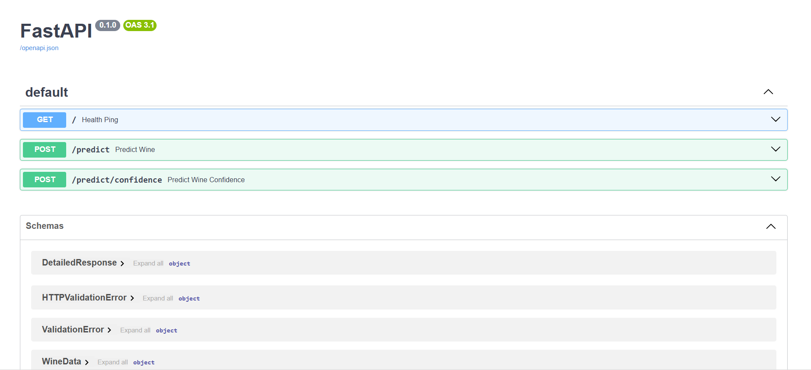
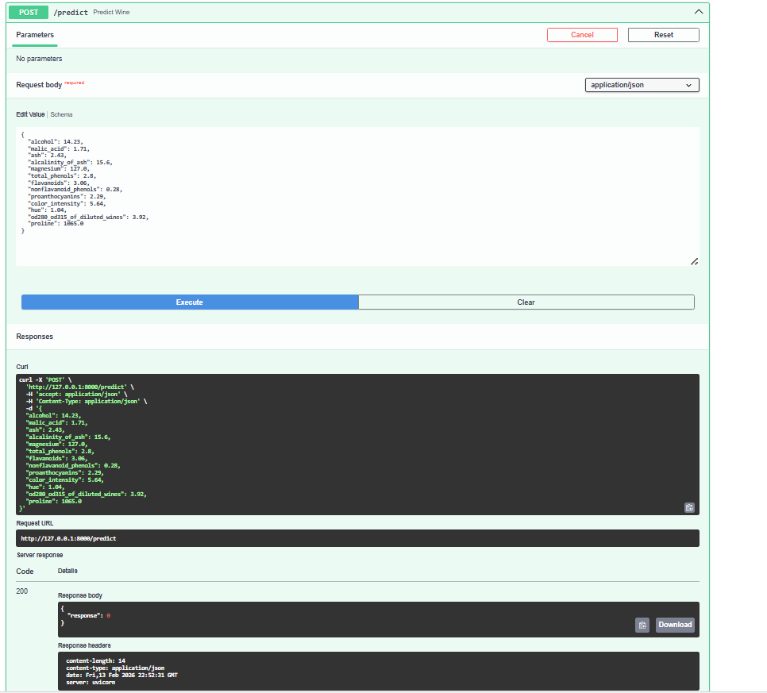
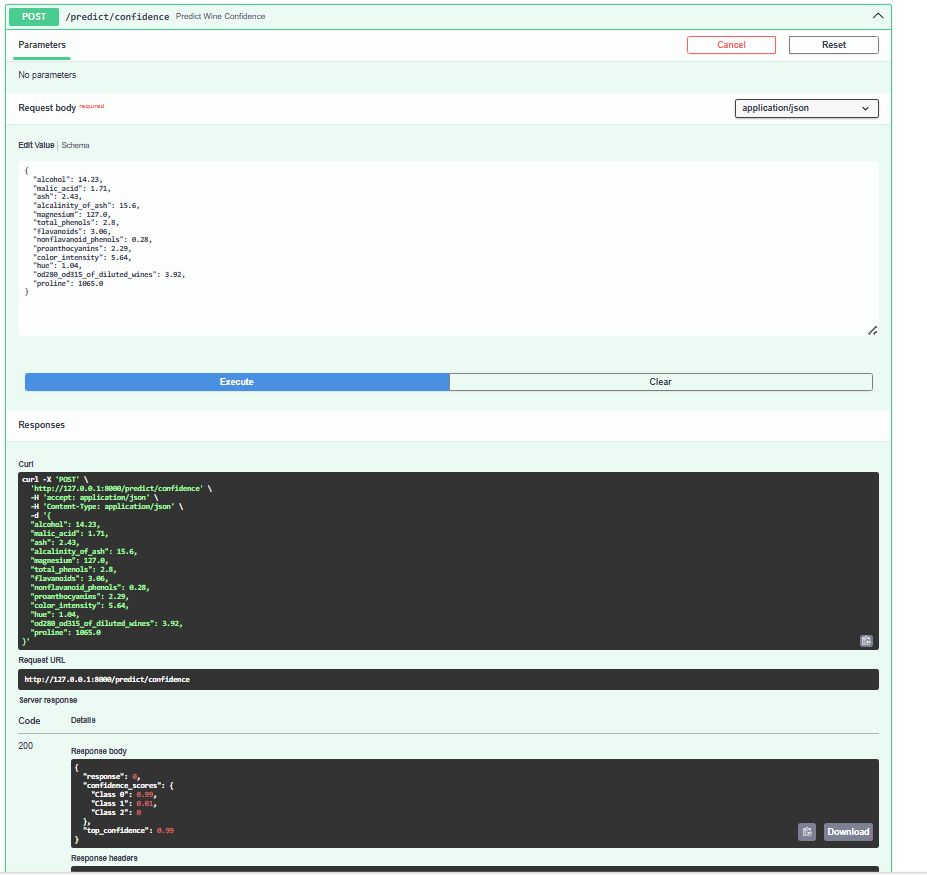

## Overview

In this lab, I converted simple scripts to production-ready MLOps by exposing a Wine Classification model as a web API using FastAPI and uvicorn.

I have used Fast API which is a high-performance web framework for building APIs with Python, utilizing standard Python type hints for automatic validation. I used Uvicorn which is a lightning-fast Asynchronous Server Gateway Interface (ASGI) server that serves your FastAPI application to the web.

The workflow involves the following steps:
1. Training a Random Forest Classifier on Wine Dataset.
2. Serving the trained model as an API using FastAPI and uvicorn.

## Setting up the lab

1. Create a conda environment by using conda create --name python=3.9 -y or virtual environment(e.g. **fastapi_lab1_env**).
2. Activate the environment using conda activate name or virtual environment and install the required packages using `pip install -r requirements.txt`.

When you will run pip install -r requirements.txt then - **fastapi[all]** in **requirements.txt** will install optional additional dependencies for fastapi which contains **uvicorn** too.

### Project structure

```
MLOps
└── API_Labs
    └── fastapi_lab1
        ├── assets/
        ├── model/
        │   └── wine_model.pkl
        ├── src/
        │   ├── __init__.py
        │   ├── data.py
        │   ├── main.py
        │   ├── predict.py
        │   └── train.py
        ├── README.md
        └── requirements.txt
```

## Running the Lab

1. First step is to train a Random Forest Classifier. To do this, move into **src/** folder with
    ```bash
    cd src
    ```
2. To train the Random Forest Classifier, run:
    ```bash
    python train.py
    ```
3. To serve the trained model as an API, run:
    ```bash
    uvicorn app:main --reload
    ```
4. Testing endpoints - to view the documentation of your api model you can use [http://127.0.0.1:8000/docs](http://127.0.0.1:8000/docs) (or) [http://localhost:8000/docs](http://localhost:8000/docs) after you run you run your FastAPI app.
    

   
You can also test out the results of your endpoints by interacting with them. Click on the dropdown button of your endpoint -> Try it out -> Fill the Request body -> Click on Execute button. You can do this for predict and confidence both the endpoints.




- You can also use other tools like [Postman](https://www.postman.com/) for API testing.
